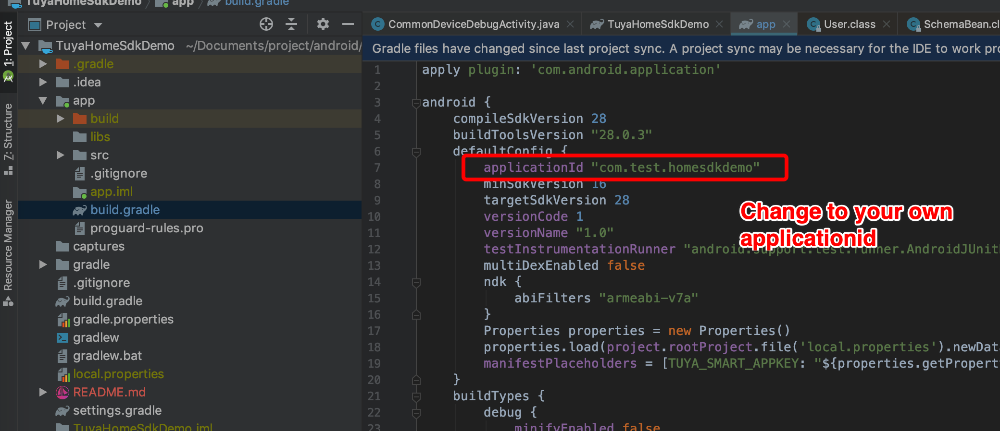
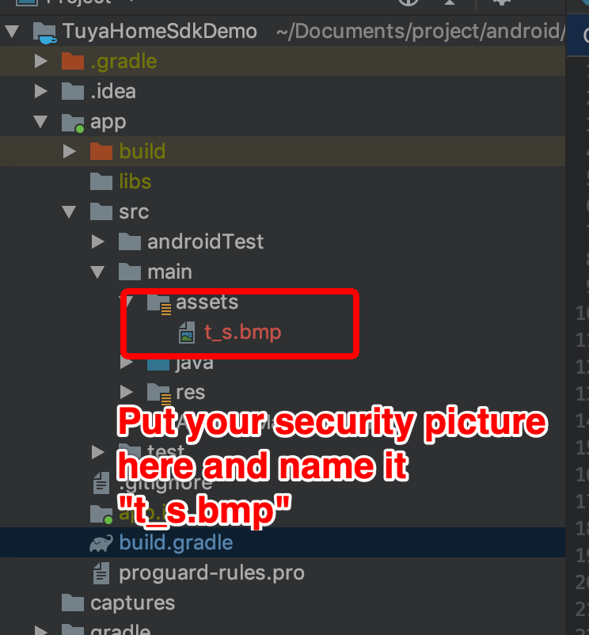
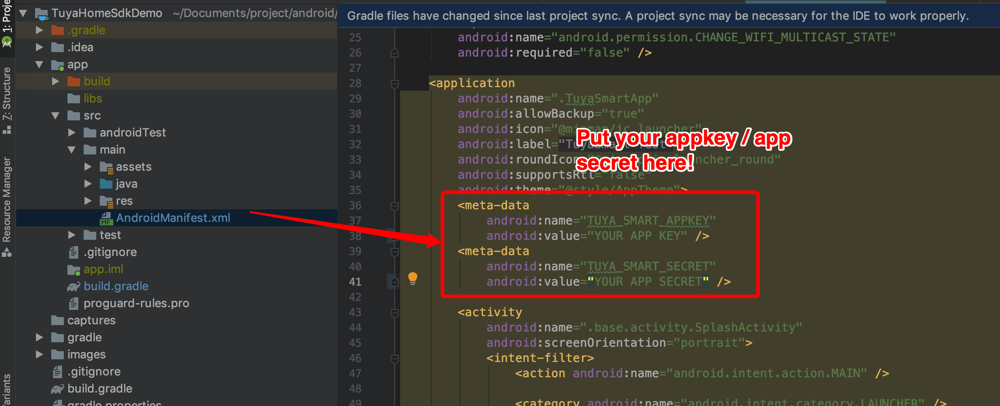

# How to use
This project is developed using Tuya App SDK, which enables you to quickly develop branded apps connecting and controlling smart scenarios of many devices.

For more information, please check [Tuya Developer Website](https://developer.tuya.com/en/docs/iot/app-development/sdk-development/app-sdk-instruction?id=K9kjstc7t376p).

